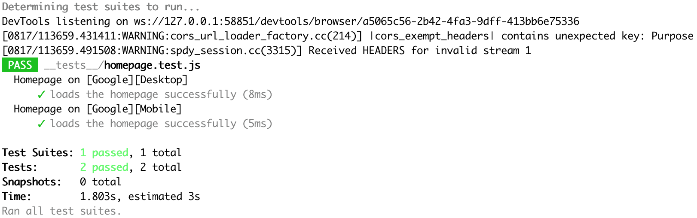

# Run Puppeteer Example
This repository contains a working example of how to get up and running with [run-puppeteer](https://github.com/danew/run-puppeteer).



## Usage
1. Clone the repository
```sh
git clone git@github.com:danew/run-puppeteer.git
```
2. Install the dependencies
```sh
npm install
```
3. Run the tests
```sh
npm test
```